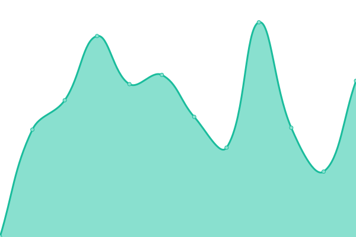
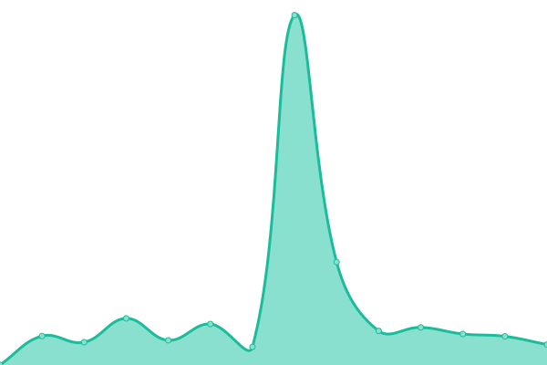

# [📈 Live Status](https://the-grey-group.github.io/datalab-status): <!--live status--> **🟩 All systems operational**

This repository contains the open-source uptime monitor and status page for [The Grey Group](https://www.ch.cam.ac.uk/group/grey/), powered by [Upptime](https://github.com/upptime/upptime).

With [Upptime](https://upptime.js.org), you can get your own unlimited and free uptime monitor and status page, powered entirely by a GitHub repository. We use [Issues](https://github.com/the-grey-group/datalab-status/issues) as incident reports, [Actions](https://github.com/the-grey-group/datalab-status/actions) as uptime monitors, and [Pages](https://the-grey-group.github.io/datalab-status) for the status page.

<!--start: status pages-->
<!-- This summary is generated by Upptime (https://github.com/upptime/upptime) -->
<!-- Do not edit this manually, your changes will be overwritten -->
<!-- prettier-ignore -->
| URL | Status | History | Response Time | Uptime |
| --- | ------ | ------- | ------------- | ------ |
|  [Datalab Public (API)](https://public.api.odbx.science) | 🟩 Up | [datalab-public-api.yml](https://github.com/the-grey-group/datalab-status/commits/HEAD/history/datalab-public-api.yml) | 

 582ms
     
 | 

<a href="https://the-grey-group.github.io/datalab-status/history/datalab-public-api">100.00%</a>
    

|  [Datalab Public](https://public.datalab.odbx.science) | 🟩 Up | [datalab-public.yml](https://github.com/the-grey-group/datalab-status/commits/HEAD/history/datalab-public.yml) | 

 507ms
     
 | 

<a href="https://the-grey-group.github.io/datalab-status/history/datalab-public">100.00%</a>
    

|  [The Grey Group Datalab (API)](https://api.odbx.science) | 🟩 Up | [the-grey-group-datalab-api.yml](https://github.com/the-grey-group/datalab-status/commits/HEAD/history/the-grey-group-datalab-api.yml) | 

 476ms
     
 | 

<a href="https://the-grey-group.github.io/datalab-status/history/the-grey-group-datalab-api">100.00%</a>
    

|  [The Grey Group Datalab](https://datalab.odbx.science) | 🟩 Up | [the-grey-group-datalab.yml](https://github.com/the-grey-group/datalab-status/commits/HEAD/history/the-grey-group-datalab.yml) | 

 577ms
     
 | 

<a href="https://the-grey-group.github.io/datalab-status/history/the-grey-group-datalab">100.00%</a>
    

|  [odbx](https://optimade.odbx.science) | 🟩 Up | [odbx.yml](https://github.com/the-grey-group/datalab-status/commits/HEAD/history/odbx.yml) | 

 409ms
     
 | 

<a href="https://the-grey-group.github.io/datalab-status/history/odbx">100.00%</a>
    

<!--end: status pages-->

[**Visit our status website →**](https://the-grey-group.github.io/datalab-status)

## 📄 License

- Powered by: [Upptime](https://github.com/upptime/upptime)
- Code: [MIT](./LICENSE) © [The Grey Group](https://www.ch.cam.ac.uk/group/grey/)
- Data in the `./history` directory: [Open Database License](https://opendatacommons.org/licenses/odbl/1-0/)
